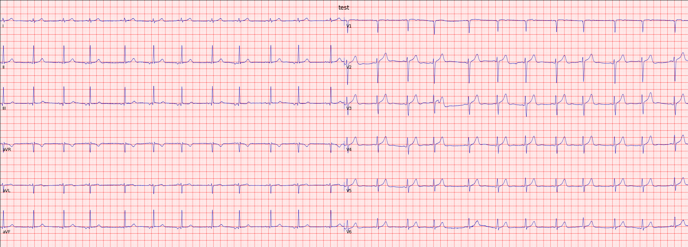

# Data

- `e0103.csv` : ECG data from a healthy subject
    - Column 0 : ECG signal
        - Lead = I
        - Sampling rate = 250 Hz
        - mV per unit = 2
- `ECG_Hz.txt` : ECG data from a healthy subject
    - Column 0 : ECG signal
        - Lead = I
        - Sampling rate = 360 Hz
        - mV per unit = 0.5
- `ECG_12L.csv` : ECG data from a healthy subject
    - Column 0-11 : ECG signal
       - The header contains the name of the leads, sampling rate and mV per unit
    - The recorded signal is represented in the following figure:
    
